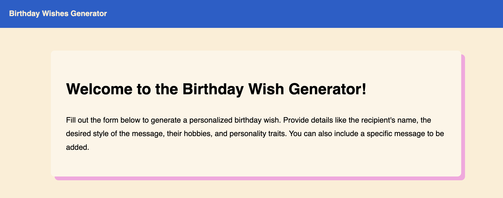
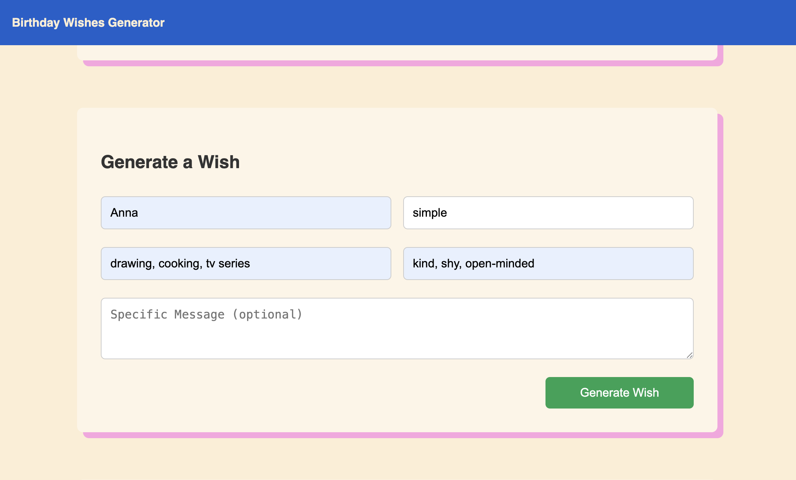
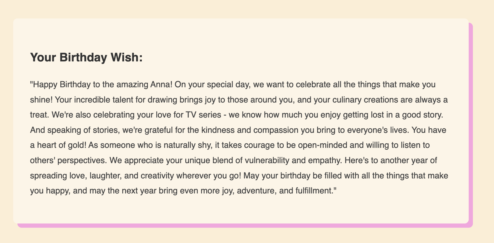

# 🎉 Birthday Wish Generator

Generate personalized, AI-crafted birthday wishes in seconds! 
Enter a recipient's name, choose a style (funny, heartfelt, poetic, etc.), and add their hobbies, personality traits, 
or a specific message — and get a custom birthday greeting.

Local web app for those who sometimes struggle to put their wishes to close ones into words. 

 



- Generate meaningful birthday wishes with just a few inputs
- Choose a writing style (e.g., funny, heartfelt, poetic)
- Add personality traits, hobbies, and custom messages
- Fully local and private – runs on your machine


### 🛠️ Tech Stack

- **Frontend**: React, Axios, React Hook Form
- **Backend**: FastAPI, Pydantic, Ollama (LLaMA 3)
- **Language Model**: LLaMA 3 (via `ollama`)
- **Styling**: Custom CSS

## 🖥️ Local Development

### 1. Clone the repository

```bash
git clone https://github.com/tsvetkovatatiana/birthday-wish-generator.git
cd birthday-wish-generator
```

### 2. Start the Backend
You can install llama3 with Ollama or try to us another model, 
but don't forget to update backend subprocess part if you do so.
```bash
cd backend
uvicorn main:app --reload
```

### 3. Start the Frontend
```bash
cd frontend
npm install
npm run dev
```
## 📝 Future Enhancements

- Save wishes permanently in a DB
- User authentication
- Sharing via social media
